# TableFox Performance Architecture Plan

Status: optimization hot path implemented on 2026-07-23; production claim remains experimental pending the reviewed 20-task corpus.

## Decision

TableFox is not currently faster or smaller than a competent direct PostgreSQL workflow. Do not claim token or time savings until the release gates below pass on a repeatable task corpus.

The fix is not a more complicated graph database. The measured cost comes from connection setup, repeated MCP calls, repeated `EXPLAIN` connections, and verbose results. The revised design keeps the existing graph and security model, but changes the hot path to two MCP calls and one database transaction.

## Measured Baseline

Task: find one captain, then retrieve documents, rest, flight time, and duty period for one year from a remote PostgreSQL database.

| Path | Wall time | Estimated response tokens |
|---|---:|---:|
| TableFox MCP | 22.65 s | 10,517 |
| Conventional catalog search and direct SQL | 6.72 s | 3,698 |

The token value is `ceil(compact JSON characters / 4)`, not provider billing. The next benchmark must also record serialized bytes and both MCP `content` and `structuredContent`, because compatible MCP clients may receive both representations.

## Implemented Single-Task Evidence

The two-call path is implemented with a lazy Psycopg pool, one checkout per batch, same-connection `EXPLAIN` and execution, relation-centric lexical retrieval, schema-derived acronym/typo handling, minimal declared-join subgraphs, byte bounds, and compact columnar rows.

On the same remote task, the final 2026-07-23 sample recorded:

| Measure | Optimized TableFox |
|---|---:|
| MCP calls | 2 |
| Sum of tool-call time | 3.90 s |
| Task-context JSON | 2,019 bytes |
| Conservative full MCP payload | 2,343 estimated tokens |
| Material answer | matched the reviewed direct-query result |

The token estimate counts both MCP `content` and `structuredContent`. This sample beats the old 22.65-second/10,517-token TableFox path and is smaller than the 3,698-token direct-path baseline. It is not enough to close median, p95, top-5 recall, or production correctness gates; those require the reviewed corpus and end-to-end process timing.

The checked-in discovery-only command `python scripts\benchmark_tablefox.py` also completed against the configured remote database in 1.63 seconds and 1,302 estimated MCP tokens, compared with 3.57 seconds and 3,443 estimated tokens for its conventional catalog-search side. This is reproducibility evidence for schema discovery, not a full-task result.

## Release Gates

All gates use the same database, task, network, process state, row limits, and answer correctness checks.

| Gate | Required result |
|---|---|
| Warm end-to-end median | `< 3.0 s` and faster than direct SQL |
| Cold end-to-end median | `< 5.0 s` and at least 20% faster than the 6.72 s baseline |
| End-to-end p95 | `< 6.0 s` across the benchmark corpus |
| Schema-context payload | `<= 6 KiB` serialized JSON |
| Full task payload | `< 2,500` estimated tokens and smaller than the direct path |
| MCP calls per task | At most 2 after connectivity is established |
| PostgreSQL connection checkouts | 1 per task bundle |
| Retrieval quality | Relevant relations in top 5 for at least 90% of corpus tasks |
| Join correctness | 100% agreement with declared PostgreSQL foreign keys/dependencies |
| Answer correctness | Same material result as the reviewed direct SQL baseline |
| Security | No regression in read-only, schema, PII, timeout, audit, or approval checks |

One successful query is not enough. The corpus must contain at least 20 reviewed tasks covering exact names, acronyms, misspellings, two-table joins, three-or-more-table joins, views, missing data, restricted schemas, and unsafe SQL.

## Revised Hot Path

```mermaid
flowchart LR
    A["Agent question"] --> B["database_task_context"]
    B --> C["Tokenize + exact lookup"]
    C --> D["BM25 field ranking"]
    C --> E["Trigram typo fallback"]
    D --> F["Top relation candidates"]
    E --> F
    F --> G["Minimal connected relation subgraph"]
    G --> H["Byte-budgeted context pack"]
    H --> I["Agent drafts bounded SQL bundle"]
    I --> J["database_readonly_batch"]
    J --> K["One pooled read-only transaction"]
    K --> L["EXPLAIN, policy, execute"]
    L --> M["Compact columnar results"]
```



The normal workflow becomes:

1. `database_task_context(question, max_relations=6, max_bytes=6144)`
2. `database_readonly_batch(queries, max_rows_each=100)`

Existing narrow tools remain for debugging and compatibility, but agents should not need search, explain, neighbor, and join-path calls separately for a normal task.

## Algorithm Combination

### 1. Relation-Centric Inverted Index

Build one searchable document per relation, not one result per graph node. Each document contains weighted fields:

- A: schema and relation name
- B: column names and declared keys
- C: comments and approved business context
- D: indexes, constraints, ORM links, and migration links

Use a hash-map inverted index from normalized term to posting list. Rank candidates with BM25F-style field weighting, then retain only top `k` relations using a bounded heap. This removes the current full-node response and avoids returning the same table once for every matching column.

BM25 is a well-established probabilistic retrieval family, including support for structured/non-textual features in BM25F. PostgreSQL's own text-ranking documentation likewise supports weighted document parts and application-specific ranking factors. Sources: [Robertson and Zaragoza, BM25 and Beyond](https://www.nowpublishers.com/article/DownloadEBook/INR-019), [PostgreSQL text search ranking](https://www.postgresql.org/docs/current/textsearch-controls.html).

Complexity:

- Build: `O(total indexed terms)` when the schema snapshot changes.
- Query: `O(sum of matching posting lists + k log k)`.
- Memory: proportional to schema text, not application rows.

### 2. Trigram Fallback

Create an in-memory trigram-to-relation posting map for relation and column names. Use trigram similarity only when exact/prefix/BM25 recall is weak. This handles misspelled schema terms such as `documents` versus the existing `doccuments` table without scanning or copying production row data.

PostgreSQL documents trigram similarity and GiST/GIN acceleration for typo-tolerant search. TableFox should implement the small schema index locally instead of requiring `CREATE EXTENSION` on a production database. Source: [PostgreSQL `pg_trgm`](https://www.postgresql.org/docs/current/pgtrgm.html).

This index must not be used for person names or other row values. Entity-name resolution stays inside guarded SQL: use normalized exact/prefix matching first; use PostgreSQL trigram similarity only when the extension is already installed and permitted; otherwise return bounded candidates for disambiguation. Downstream batch queries can repeat a small candidate CTE and must expose the resolved identity and ambiguity count.

### 3. Adjacency List and Minimal Join Subgraph

Keep the existing relation adjacency list backed only by declared foreign keys and catalog dependencies.

- Two terminals: ordinary BFS remains sufficient and exact.
- Three or more terminals: compute pairwise shortest paths, form the metric closure, run a minimum spanning tree, then expand its edges back into schema paths. This is a standard practical approximation to connecting required terminals in a Steiner tree.
- Reject disconnected candidates instead of inventing joins.

Source: [Takahashi-Matsuyama family of Steiner heuristics](https://tus.repo.nii.ac.jp/record/2840/files/1538A.pdf).

Do not add all-pairs shortest-path labels or a graph database now. The measured graph operations are already about 20-60 ms. Consider bidirectional BFS only when a benchmark exceeds 10,000 relations or pair-path p95 exceeds 10 ms.

### 4. Greedy Byte-Budget Packer

Pack context in this fixed priority order until `max_bytes`:

1. Stable relation IDs and match evidence.
2. Matched columns and primary/foreign-key columns.
3. Join edges required by the minimal connected subgraph.
4. Types, nullability, comments, and verified context.
5. Optional indexes and usage signals.

Return `truncated`, `omitted_counts`, and a cursor when the budget is exhausted. This is a bounded greedy selection problem; exact knapsack optimization would add complexity without improving this small, ordered payload.

### 5. Fingerprint-Keyed LRU Cache

Cache only immutable derived schema artifacts:

- normalized relation documents;
- posting lists and trigrams;
- adjacency lists;
- repeated task-context packs.

Keys include database identity, schema fingerprint, context-file fingerprint, normalized question, and output budget. Do not cache application query rows.

Keep this cache on the index instance, not on the method. `functools.lru_cache` applied to a method makes `self` part of the key, so every superseded index and the entire snapshot behind it stay reachable for the life of the process — which the 30-second live refresh turned into steady growth. A bounded `OrderedDict` on the instance dies with the index. Source: [Python `functools.lru_cache`](https://docs.python.org/3/library/functools.html#functools.lru_cache).

### 6. Fixed-Length Delivery Window

Caching computation does not reduce tokens: an identical pack still serializes into the model's context. Tokens only fall when TableFox stops repeating what the agent already received.

The delivery window is therefore a fixed-length record of relations already sent, evicted in sliding order rather than by time. A repeat relation returns as a bare id; a relation needing extra columns returns only those columns as a delta, so nothing the agent has not seen is ever suppressed. It clears on schema-fingerprint change and on `refresh_context=true`.

Measured at window 16 on the 14-task corpus: mean task tokens fall from 976 to 879. It ships disabled, because the saving assumes the agent still holds the earlier pack — an assumption a compacted conversation breaks. That cost is stated wherever the setting is offered.

## Connection And Query Architecture

### One Checkout, One Transaction

`PostgresIntrospector.readonly_batch()` must:

1. Check out one pooled connection.
2. Start one read-only transaction.
3. Set transaction, statement, and lock timeouts once.
4. Run `EXPLAIN` and policy validation on that connection.
5. Execute only approved statements on the same connection.
6. Roll back and return the connection to the pool.

The current implementation opens a connection for `EXPLAIN` and another for execution for every query. Psycopg documents connection setup as relatively expensive and pooling as the mechanism for reducing that latency. Source: [Psycopg connection pools](https://www.psycopg.org/psycopg3/docs/advanced/pool.html).

Use a pool size of 1 for stdio MCP and 2-4 for the local API. Make these limits configurable only because deployment concurrency differs.

### Batch Independent Reads

`database_readonly_batch` accepts at most five named `SELECT`/`WITH` statements and a total result-byte ceiling. It returns:

```json
{
  "results": [
    {"name": "monthly_activity", "columns": ["month", "ft"], "rows": [["2026-03", 7.5]]}
  ],
  "policy": {"all_verified": true},
  "truncated": false
}
```

Columnar rows avoid repeating object keys for every row. Pipeline mode is deferred until a same-connection benchmark still shows network round trips as the bottleneck; Psycopg supports batching commands without waiting for each result, but error and policy sequencing make it a second optimization. Source: [Psycopg pipeline mode](https://www.psycopg.org/psycopg3/docs/advanced/pipeline.html).

## MCP Response Contract

Default responses must be compact and have explicit output schemas:

```json
{
  "relations": [
    {
      "id": "table:public.actual_crew_log",
      "columns": ["crew_id", "duty_time", "flight_duty_time"]
    }
  ],
  "joins": [
    ["table:public.actual_crew_log", "crew_id", "table:public.crew", "id"]
  ],
  "connected": true,
  "bytes": 412
}
```

Full metadata becomes `detail="full"` and is opt-in. MCP supports structured results and output schemas; list pagination exists specifically to bound large exchanges. Sources: [MCP tools and structured results](https://modelcontextprotocol.io/specification/2025-06-18/server/tools), [MCP pagination](https://modelcontextprotocol.io/specification/draft/server/utilities/pagination).

## SOLID Boundaries Without Extra Layers

- `PostgresIntrospector`: pool ownership, catalog refresh, and guarded batch execution.
- `RetrievalIndex`: pure relation-document indexing and ranking.
- `GraphEngine`: adjacency and join-subgraph algorithms.
- `ContextPacker`: pure byte-bounded response shaping.
- `DatabaseMapService`: orchestration, authorization, and auditing.
- FastAPI/MCP: transport translation only.

Do not add interfaces until a second implementation exists. Keep ranking, graph, and packing functions pure so they are testable without PostgreSQL.

## Security Invariants

Performance work must not remove:

- read-only transactions and least-privilege role checks;
- allowed/restricted schema enforcement before indexing;
- `SELECT`/`WITH` validation, row limits, and timeouts;
- `EXPLAIN` without `ANALYZE` before execution;
- declared-relationship validation for multi-relation queries;
- sensitive-column policy and explicit operator opt-in;
- per-user authorization and SQL-hash-only audit events;
- no local indexing or caching of application rows.

## Delivery Phases

### Phase 0: Correct The Benchmark

Implementation: mostly complete. `scripts/benchmark_corpus.py` with `scripts/corpus_tasks.json` runs a reviewed corpus with repeats, separates cold from warm, reports median and p95, counts both MCP payload representations, and checks retrieval recall and answer agreement automatically. The corpus holds 14 tasks; 20 are still required.

Measured on 2026-09-01 with `--repeat 3`: TableFox warm median 1,200 ms and p95 1,519 ms against a conventional median of 2,396 ms; mean 976 estimated tokens per task against 1,240; answers agreed 14/14; recall 13/14.

Four defects were fixed in the same cycle, all of which had been inflating cost:

- the live graph socket re-introspected the entire catalog every 30 seconds per browser tab, roughly 6.3 seconds of query work each time, and discarded the retrieval index with it;
- batch and context responses serialized their own byte count twice;
- `RetrievalIndex.context` carried a method-level `lru_cache`, so every discarded index and its whole snapshot stayed reachable for the life of the process;
- term expansion ran the acronym and trigram paths over ordinary words, producing false readings (`is=investment submissions`, `all~allow`) and reporting plain plurals as typo corrections. Correcting this also sharpened ranking enough to cut mean task tokens by roughly a sixth.

- Record cold and warm runs separately.
- Measure MCP startup, pool wait, graph retrieval, database time, serialization bytes, and tool count.
- Count both structured and compatibility text payloads.
- Add the 20-task reviewed corpus and direct SQL expected results.

Exit: benchmark is deterministic enough to compare five runs per task and reports median/p95.

### Phase 1: Remove Connection Waste

Implementation: complete. Corpus exit gate remains pending.

- Add the small Psycopg pool.
- Run `EXPLAIN` and execution on one connection.
- Add guarded `readonly_batch` with one transaction.

Exit: warm data retrieval beats the direct path without weakening policy.

### Phase 2: Make Responses Compact

Implementation: complete for the two-call path. Corpus exit gate remains pending.

- Group matches by relation.
- Default search limit to 8 relations.
- Add compact/full detail modes and columnar row output.
- Enforce byte ceilings and report truncation.

Exit: full benchmark payload is below 2,500 estimated tokens.

### Phase 3: Build The Task Context Retriever

Implementation: complete. Top-5 recall exit gate remains pending the labeled corpus.

- Build the fingerprint-keyed inverted/trigram index once per snapshot.
- Add BM25F-style ranking and typo fallback.
- Add minimal connected-subgraph selection for multi-relation tasks.
- Expose `database_task_context` with a strict output schema.

Exit: top-5 relation recall is at least 90% and normal tasks use no more than two MCP calls.

### Phase 4: Optimize Only What Still Fails

Implementation: pipeline mode and additional graph indexes remain deferred because the measured single-task latency does not justify them.

- Try Psycopg pipeline mode only if remote round trips dominate.
- Try bidirectional BFS only if graph traversal exceeds its gate.
- Tune ranking weights only against labeled retrieval failures.

Exit: every release gate passes. Otherwise TableFox keeps an experimental performance label.

## Explicitly Deferred

- Vector database or embedding model: adds cost, deployment, and data-governance work before lexical retrieval is proven insufficient.
- PageRank/personalized PageRank: global graph popularity can over-rank central utility tables; add only if labeled retrieval shows a graph-ranking gap. The original algorithm is documented by [Stanford InfoLab](https://ilpubs.stanford.edu/422/).
- Graph database: the current relation graph fits in memory and traversal is not the bottleneck.
- All-pairs or 2-hop path indexes: unnecessary at the current graph size.
- Production `pg_trgm` extension requirement: TableFox has read-only credentials and should not alter the target database.
- Query-result cache: risks stale or sensitive data and does not help one-off agent questions.
- Autonomous natural-language-to-SQL inside TableFox: the LLM already performs that role; TableFox should return verified context and enforce execution policy.

## Product Claim Rule

Until all release gates pass, use this wording:

> TableFox provides bounded, evidence-backed PostgreSQL context and guarded query execution for AI agents. Performance and token savings are measured goals, not current guarantees.
