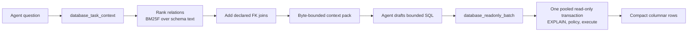
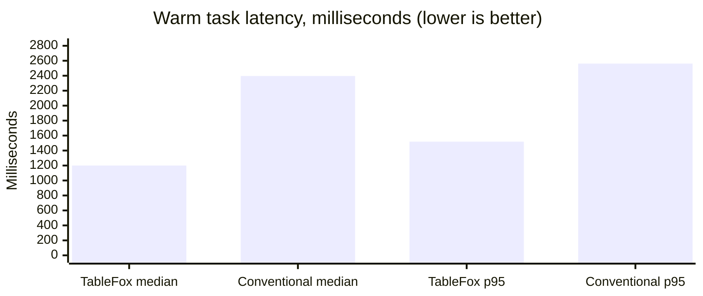
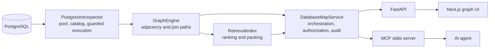

<p align="center">
  
</p>

<h1 align="center">TableFox</h1>

<p align="center">
  <strong>Bounded PostgreSQL schema context and guarded query execution for AI agents.</strong>
</p>

<p align="center">
  TableFox maps a PostgreSQL database into a searchable graph, so an agent can retrieve the few tables a question actually needs instead of pasting the whole schema into every prompt — then run its SQL through a read-only guard.
</p>

<p align="center">
  
  
  
  
  
  
  
</p>

## Start here

| I want to… | Read |
|---|---|
| Ask my database questions from ChatGPT or Claude | [User guide](docs/USER_GUIDE.md) |
| Use TableFox from Claude Code, Codex, Cursor, VS Code, Gemini CLI or Windsurf | [Agents and assistants](docs/AGENTS.md) |
| Run, change or host TableFox myself | [Developer guide](docs/DEVELOPER_GUIDE.md) |

Hosted: **https://tablefox.onrender.com** · MCP address `https://tablefox.onrender.com/mcp`

---

## The problem

An agent pointed at a database does not know the schema. The usual fix is to paste a schema dump into the prompt, which grows with the database, costs tokens on every turn, and still produces hallucinated table names.

TableFox replaces the dump with a retrieval step:


```mermaid
flowchart LR
    Q["Agent question"] --> T["database_task_context"]
    T --> R["Rank relations<br/>BM25F over schema text"]
    R --> G["Add declared FK joins"]
    G --> P["Byte-bounded context pack"]
    P --> S["Agent drafts bounded SQL"]
    S --> B["database_readonly_batch"]
    B --> X["One pooled read-only transaction<br/>EXPLAIN, policy, execute"]
    X --> A["Compact columnar rows"]
```

Two MCP calls per task. One database connection checkout. Nothing about application rows is ever indexed or cached.

---

## Measured results

Benchmarked against a live remote PostgreSQL database (38 tables, single schema) using a reviewed 14-task corpus, 3 repeats per task (42 executions). The comparison path is what a competent developer does without TableFox: `information_schema` catalog searches, then hand-written SQL on a fresh connection.

Reproduce with `python scripts/benchmark_corpus.py --repeat 3`.

| Measure | TableFox | Conventional catalog + direct SQL |
|---|---:|---:|
| Warm median, end to end | **1,200 ms** | 2,396 ms |
| Warm p95 | **1,519 ms** | 2,562 ms |
| Cold median (first task in a new process) | 2,683 ms | 2,396 ms |
| Mean estimated tokens per task | **976** | 1,240 |
| Answers matching the direct-SQL baseline | **14 / 14** | baseline |
| Relevant relations retrieved | 13 / 14 (93%) | n/a |

With the optional context window at 16, mean tokens per task fall further to **879** (29% below the conventional path).

Latency figures come from one 3-repeat run; across independent runs warm median moved between 1,200 and 1,301 ms and the conventional median between 2,256 and 2,494 ms, so treat latency as approximate and token counts — which varied by under 1% — as stable.


```mermaid
---
config:
  xyChart:
    width: 760
    height: 320
---
xychart-beta
    title "Warm task latency, milliseconds (lower is better)"
    x-axis ["TableFox median", "Conventional median", "TableFox p95", "Conventional p95"]
    y-axis "Milliseconds" 0 --> 2800
    bar [1200, 2396, 1519, 2562]
```

<sub>Token counts above are `ceil(compact JSON characters / 4)` over both MCP `content` and `structuredContent` — a comparable estimate, not provider billing.</sub>

### Conditions, stated plainly

The corpus database has 38 tables but only a handful of rows per table. Latency is therefore dominated by connection setup and protocol overhead, not by scanning data. These numbers say TableFox's *retrieval and execution path* is efficient; they do not predict behaviour on large result sets. Timings come from one machine over one network to one remote database.

### Where TableFox does not win

Honest limits, all measured:

- **Cold start is slower.** A fresh MCP process pays pool and process setup, so the first task lands around 2,683 ms against the conventional 2,396 ms. TableFox only pulls ahead from the second task onward. Sessions that ask exactly one question will not benefit.
- **Retrieval is lexical, so it cannot see meaning that lives in row values.** In the corpus, "who changed leave settings" needs `audit_logs`, whose only link to the word *leave* is the stored value `entity_type = 'leave_policy'`. TableFox never indexes application rows by design, so it misses this table until an owner describes it (see [Approved context](#approved-context)). That single case is the 13/14.
- **Simple single-table lookups gain the least.** A question like "list all public holidays" is answerable from one catalog search, so the margin narrows.

---

## What it maps

| Database object | Captured |
|---|---|
| Schemas | names, filtering, allow/deny policy |
| Tables, views, materialized views | comments, row estimates, optional usage counters |
| Columns | type, nullability, default, comment |
| Keys and constraints | primary, foreign, unique, check, exclusion |
| Indexes | columns, uniqueness, definition |
| Relationships | foreign keys plus `pg_depend` view dependencies |

---

## Architecture


```mermaid
flowchart LR
    A[(PostgreSQL)] --> B["PostgresIntrospector<br/>pool, catalog, guarded execution"]
    B --> C["GraphEngine<br/>adjacency and join paths"]
    C --> D["RetrievalIndex<br/>ranking and packing"]
    C --> E["DatabaseMapService<br/>orchestration, authorization, audit"]
    D --> E
    E --> F["FastAPI"]
    E --> G["MCP stdio server"]
    F --> H["Next.js graph UI"]
    G --> I["AI agent"]
```

Application rules live in `DatabaseMapService` once. FastAPI and MCP only translate transport, so adding an interface never duplicates a safety rule.

---

## Safety model

TableFox assumes the database is production.

| Control | Behaviour |
|---|---|
| Statement validation | `SELECT` / `WITH` only; writes, DDL, multi-statement SQL, row locks and privileged functions rejected before connecting |
| Transaction | read-only, with statement and lock timeouts |
| Plan check | `EXPLAIN` without `ANALYZE` runs first; cost and estimated-row ceilings apply |
| Multi-relation queries | rejected unless declared foreign keys or catalog dependencies connect every relation |
| Sensitive columns | credential and PII-like result columns blocked unless an operator opts in |
| Schema policy | allow/deny lists enforced before metadata is cached; restricted schemas cannot be overridden, even by an admin |
| Approvals | out-of-policy queries need an authenticated API admin; MCP cannot self-approve |
| Audit | JSONL events record actor, action and SQL **hash** — never SQL text or result rows |
| Binding | the API refuses to bind to anything but loopback |

These are defence in depth, not a substitute for a least-privilege PostgreSQL role. Create one:

```sql
create role dbmap_reader login password 'replace-with-a-strong-password';
alter role dbmap_reader set default_transaction_read_only = on;
grant connect on database your_database to dbmap_reader;
grant usage on schema public to dbmap_reader;
grant select on all tables in schema public to dbmap_reader;
-- table_owner = the role that creates your tables; covers tables added later
alter default privileges for role table_owner in schema public grant select on tables to dbmap_reader;
```

---

## Quick start

```powershell
.\run.cmd -Install    # first time: create the venv and install dependencies
.\run.cmd             # start the API and UI, then open http://localhost:3000
.\run.cmd -Check      # validate credentials and build a graph, then exit
```

Configure the database in `.env` (copy from `.env.example`) using either `DATABASE_URL` or the `PG*` variables. `DATABASE_URL` wins when both are present.

---

## MCP tools

Point an MCP client at `scripts/run_mcp.ps1`; it loads the repository `.env`, so credentials stay out of client configuration.

```json
{
  "mcpServers": {
    "tablefox-postgres": {
      "command": "powershell",
      "args": ["-ExecutionPolicy", "Bypass", "-File", "C:\\path\\to\\TableFox\\scripts\\run_mcp.ps1"]
    }
  }
}
```

**The two calls that matter**

| Tool | Purpose |
|---|---|
| `database_task_context` | Ranked relations, useful columns and declared joins for one question, within a byte budget |
| `database_readonly_batch` | Up to five named guarded reads in one transaction, returned as compact columnar rows |

**Everything else, for when context is ambiguous**

| Tool | Purpose |
|---|---|
| `database_connectivity_check` | Confirm credentials and server identity |
| `database_search` | Find objects by name, comment, or type |
| `database_explain_object` | One object with its columns and relationships |
| `database_neighbors` | Nearby connected nodes |
| `database_find_join_path` | Prove a join route from declared keys |
| `database_source_of_truth` | Rank authoritative candidates with evidence |
| `database_graph_snapshot` | Bounded whole-graph inventory |
| `database_explain_query` | Plan SQL without executing it |
| `database_readonly_query` | A single guarded read |
| `database_schema_changes` | Compare a baseline against the live database |
| `database_context_identity` | Database identity and schema fingerprint |
| `database_context_window` | Read or set the context window, with its measured savings and cost |

See [MCP_AGENT_GUIDE.md](./MCP_AGENT_GUIDE.md) for the recommended workflow.

---

## Context window

Repeating the same table definitions to an agent across a session wastes tokens. The context window is a **fixed-length record of relations already sent** — not a time-based cache. When a later task needs a relation the agent has already received, TableFox returns its id instead of its columns, and sends only genuinely new columns as a delta.

| Window | Effect on the corpus |
|---|---|
| `0` (default) | Every context sent in full |
| `8` | Modest reduction |
| `16` | Mean tokens per task 976 → 879 |
| `32` | Diminishing returns |

**The cost, stated up front:** relations returned as ids only are ones the agent is assumed to still have in context. If its conversation is compacted or truncated, those column lists may be gone. Any call can pass `refresh_context=true` to get full detail again, and the window clears itself whenever the schema fingerprint changes.

It ships **disabled**. Enable it in the UI rail, via `DBMAP_CONTEXT_WINDOW`, or by letting the agent call `database_context_window` — which returns the measured savings and this caveat so it can ask you which value you want.

---

## Approved context

Lexical retrieval only sees schema text. A table whose meaning lives in its data — an audit log keyed by `entity_type`, say — needs a description before it can be found by meaning.

```powershell
dbmap-context-scaffold           # write a .tablefox-context.json skeleton
```

Fill in each `description`, and those tables become discoverable. In the corpus, describing `audit_logs` takes retrieval from 13/14 to 14/14. The same manifest carries owners, classifications, documented consumers and source-of-truth assertions; ORM and migration links are ignored unless both the database identity and schema fingerprint match.

---

## HTTP API

| Method | Endpoint | Purpose |
|---|---|---|
| `GET` | `/health` | Health check |
| `GET` | `/graph` | Full graph, optionally filtered |
| `GET` | `/graph/search?q=` | Search objects |
| `GET` | `/graph/node/{id}` | Explain one object |
| `GET` | `/graph/identity` | Identity and schema fingerprint |
| `GET` | `/graph/changes` | Compare the configured baseline |
| `POST` | `/query/explain` | Plan without executing |
| `POST` | `/query/readonly` | One guarded query |
| `POST` | `/query/readonly-batch` | Up to five guarded reads |
| `POST` | `/workflow/task-context` | Ranked context for one task |
| `POST` | `/workflow/join-path` | Verified relationship path |
| `GET` | `/workflow/source-of-truth?q=` | Authoritative candidates |
| `GET`/`POST` | `/settings/context-window` | Read or set the window (admin to set) |
| `WS` | `/graph/live` | Live graph stream |

Enable authentication with `dbmap-create-key`, a `tablefox-auth.json` holding only SHA-256 hashes, and `DBMAP_AUTH_REQUIRED=true`. Roles are `viewer`, `analyst`, `data_reader` and `admin`.

---

## Operations

```powershell
python -m pytest services/dbmap/tests     # 67 tests
python -m ruff check services scripts
python scripts/benchmark_corpus.py --repeat 3
dbmap-save-baseline                       # snapshot the schema
dbmap-review --baseline .dbmap-cache/baseline.snapshot.json --output schema-impact.json
```

The live graph socket serves heartbeats from cache and re-introspects the catalog only every `DBMAP_LIVE_REFRESH_SECONDS` (default 600), because a full introspection costs seconds against a remote database. The UI Refresh button still forces an immediate rebuild.

[FUNCTIONAL_CHECKLIST.md](./FUNCTIONAL_CHECKLIST.md) is the release gate. [PERFORMANCE_ARCHITECTURE_PLAN.md](./PERFORMANCE_ARCHITECTURE_PLAN.md) records the performance design and the gates still open.

---

## Status

TableFox provides bounded, evidence-backed PostgreSQL context and guarded query execution. The numbers above are real and reproducible on the corpus described, on one database. They are not a claim about every workload: the release gates in the performance plan require a larger reviewed corpus, and remain open.

## Roadmap

- [ ] Widen the reviewed corpus beyond 14 tasks and across more databases
- [ ] Graph export as JSON and Mermaid ER diagrams
- [ ] Index and constraint hints from plan evidence
- [x] External identity-provider integration for hosted deployments (OAuth, multi-user)

## License

[MIT](LICENSE) © 2026 Adhrit Verma

<p align="center"><strong>Give your agent a map before it queries the database.</strong></p>
